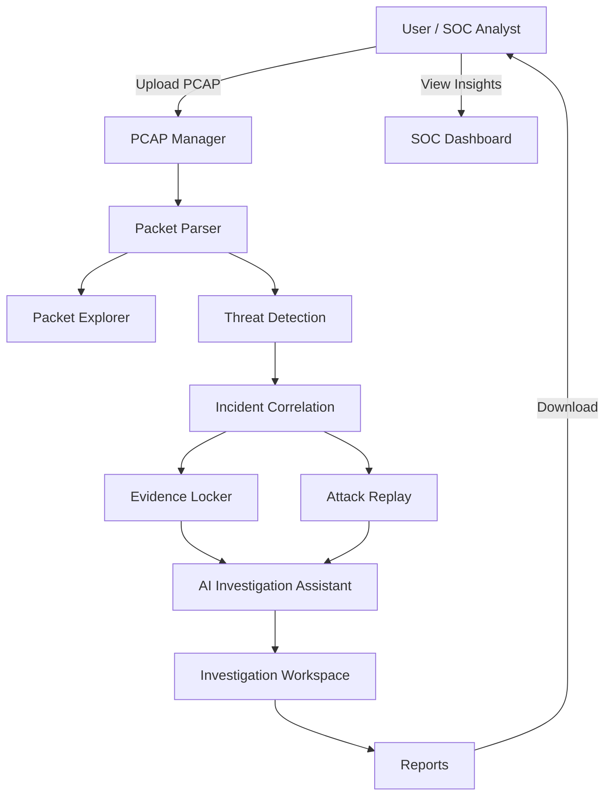

<div align="center">
  <!-- Project Logo Placeholder -->
  

  # TraceIQ

  **AI-Powered Cyber Investigation & Network Forensics Platform**

  [](https://github.com/yourusername/TraceIQ)
  [](https://opensource.org/licenses/MIT)
  [](http://makeapullrequest.com)

  
  
  
  
  
  
</div>

---

## 📖 Project Overview

**TraceIQ** is an enterprise-grade AI-powered Cyber Investigation and Network Forensics Platform.

Designed to simplify complex cybercrime investigations, TraceIQ empowers investigators to upload PCAP files, automatically analyze captured network traffic, detect advanced threats, and seamlessly correlate incidents.

- **Main Objective:** To provide a streamlined, intelligent, and visual approach to network forensics, reducing the time required to investigate cyber incidents.
- **Target Users:** Security Operations Center (SOC) Analysts, Incident Responders, Cyber Forensic Investigators, and Network Security Engineers.
- **Key Advantages:** 
  - Shifts focus from manual packet inspection to high-level investigation workflows.
  - Integrates AI to provide automated summaries, threat insights, and investigation assistance.
  - Offers powerful incident correlation and attack replay mechanisms natively.

---

## 🎯 Problem Statement

Modern network forensics relies heavily on manual packet analysis using tools like Wireshark. As network traffic grows in volume and complexity, manual inspection becomes overwhelmingly time-consuming and error-prone. Security analysts face alert fatigue and struggle to piece together fragmented evidence across massive PCAP files to reconstruct the complete timeline of a cyberattack. There is a critical need for an automated, AI-driven platform that elevates raw packet data into actionable investigative intelligence.

---

## 🔍 Existing Solutions

| Tool | Focus | Limitations |
|------|-------|-------------|
| **Wireshark** | Deep packet inspection. | Highly manual, lacks high-level threat correlation and AI analysis; steep learning curve for complex investigations. |
| **Zeek** | Network security monitoring. | Primarily generates logs; requires external tools (like ELK) for visualization and advanced correlation. |
| **Suricata** | Intrusion detection (IDS/IPS). | Signature-based; heavily focused on alerting rather than providing a holistic investigation workspace. |
| **Security Onion** | Full Linux distro for threat hunting. | Resource-intensive, complex deployment, and often overwhelming for focused, standalone PCAP investigations. |

---

## 💡 Proposed Solution

TraceIQ redefines network forensics by focusing on the **investigation workflow** rather than just packet parsing. 

Key differentiators include:
- **SOC Dashboard:** A high-level overview of network health, risk scores, and recent alerts.
- **PCAP Manager:** Centralized upload and management of packet capture files.
- **Packet Explorer:** Advanced, highly visual interface for exploring parsed packets without the clutter.
- **Threat Detection:** Automated identification of malicious patterns and anomalies.
- **Incident Correlation:** Intelligent grouping of related packets into coherent incident timelines.
- **AI Investigation Assistant:** Generative AI capabilities to explain attacks and suggest remediation.
- **Attack Replay:** Step-by-step visual reconstruction of how a threat propagated through the network.
- **Evidence Locker:** Secure storage for pinning critical packets, logs, and notes during an investigation.
- **Investigation Workspace:** A dedicated environment for collaborating and compiling forensic cases.
- **Reports:** Automated generation of comprehensive, boardroom-ready investigation reports.

---

## ✨ Features

- 🔐 **Role-Based Access Control (RBAC):** Secure authentication and authorization for different user tiers.
- 📊 **Enterprise SOC Dashboard:** Custom dark-themed widgets for KPIs, alert trends, and AI threat summaries.
- 📁 **Centralized PCAP Management:** Scalable storage and processing queue for large capture files.
- 🧠 **AI-Powered Analysis:** Leverage generative models for automated threat explanation and hunting queries.
- 🔗 **Intelligent Correlation Engine:** Automatically link disparate network events to reconstruct attack paths.
- ⏪ **Attack Replay Engine:** Visually step through network interactions as they occurred in time.
- 🔒 **Evidence Locker:** Pin, tag, and export specific packets or artifacts for chain-of-custody preservation.

---

## 🏗️ System Architecture



---

## 🧩 Module Overview

| Module | Purpose | Status |
|--------|---------|--------|
| **Authentication & RBAC** | Secure user login, session management, and permissions. | 🟢 Active |
| **SOC Dashboard** | High-level widgets, KPIs, and recent alerts summary. | 🟢 Active |
| **PCAP Manager** | Upload, store, and manage captured packet files. | 🟡 In Progress |
| **Packet Parser** | Deep extraction of network protocols and payloads. | 🟡 In Progress |
| **Packet Explorer** | Search, filter, and visualize raw network data. | ⚪ Planned |
| **Threat Detection Engine** | Identify signatures and anomalous network behavior. | ⚪ Planned |
| **Incident Correlation Engine**| Stitch events into comprehensive timelines. | ⚪ Planned |
| **Investigation Workspace** | Collaborative environment for ongoing cases. | ⚪ Planned |
| **Evidence Locker** | Securely tag and store artifacts for reporting. | ⚪ Planned |
| **Attack Replay Engine** | Playback network interactions chronologically. | ⚪ Planned |
| **AI Investigation Assistant** | AI-driven insights, explanations, and queries. | ⚪ Planned |
| **Reports** | Generate PDF/HTML forensic reports. | ⚪ Planned |
| **Administration** | Manage users, system settings, and integrations. | ⚪ Planned |

---

## 📁 Folder Structure

```text
TraceIQ/
├── backend/                  # FastAPI Application
│   ├── main.py               # Application entry point
│   ├── database/             # SQLAlchemy models and migrations
│   ├── routers/              # API Endpoints
│   ├── services/             # Core business logic (Parser, Correlation, AI)
│   └── requirements.txt      # Python dependencies
├── frontend/                 # Next.js Application
│   ├── src/                  # React components and pages
│   ├── public/               # Static assets
│   ├── tailwind.config.js    # Tailwind CSS configuration
│   └── package.json          # Node dependencies
├── .env.example              # Environment variables template
├── docker-compose.yml        # Multi-container orchestration
└── README.md                 # Project documentation
```

---

## 🛠️ Tech Stack

- **Frontend:** Next.js, React, Tailwind CSS
- **Backend:** FastAPI, Python
- **Database:** PostgreSQL (Relational Data), SQLAlchemy ORM
- **Caching & Queues:** Redis, Celery (for background PCAP processing)
- **Authentication:** JWT, OAuth2
- **AI / Parsing:** Scapy, PyShark, Generative AI APIs
- **Deployment:** Docker, Docker Compose

---

## 🚀 Installation Guide

### Prerequisites
- [Python 3.10+](https://www.python.org/downloads/)
- [Node.js 18+](https://nodejs.org/)
- [Docker & Docker Compose](https://www.docker.com/) (Optional but recommended)

### 1. Clone the Repository
```bash
git clone https://github.com/yourusername/TraceIQ.git
cd TraceIQ
```

### 2. Infrastructure Setup (Optional but recommended)
Start the PostgreSQL database and Redis instances using Docker:
```bash
docker-compose up -d
```

### 3. Backend Setup
Open a terminal and navigate to the backend directory:
```bash
cd backend
python -m venv venv
source venv/bin/activate  # On Windows use `venv\Scripts\activate`
pip install -r requirements.txt
```
Copy `.env.example` to `.env` (if applicable) and configure your environment variables.
Run the FastAPI application:
```bash
python -m uvicorn main:app --reload --port 8000
```
*The backend API will run at http://localhost:8000.*

### 4. Frontend Setup
Open a new terminal and navigate to the frontend directory:
```bash
cd frontend
npm install
npm run dev
```
*The Next.js dashboard will run at http://localhost:3000.*

---

## 🔮 Future Scope

- Integration with standard SIEMs (Splunk, QRadar) via Webhooks/APIs.
- Advanced Machine Learning models for zero-day threat detection.
- Distributed PCAP parsing using Apache Kafka and Apache Spark for massive enterprise deployments.
- Multi-tenancy support for Managed Security Service Providers (MSSPs).

---

## 🖼️ Screenshots

> **Note:** Screenshots of the SOC Dashboard, Packet Explorer, and Attack Replay will be added here once fully deployed.

---

## 👥 Contributors

- **[Your Name]** - *Lead Architect & Developer* - [@yourusername](https://github.com/yourusername)

---

## 📄 License

This project is licensed under the MIT License - see the [LICENSE](LICENSE) file for details.
